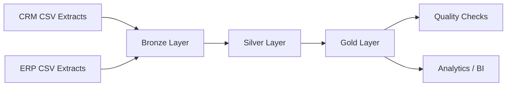
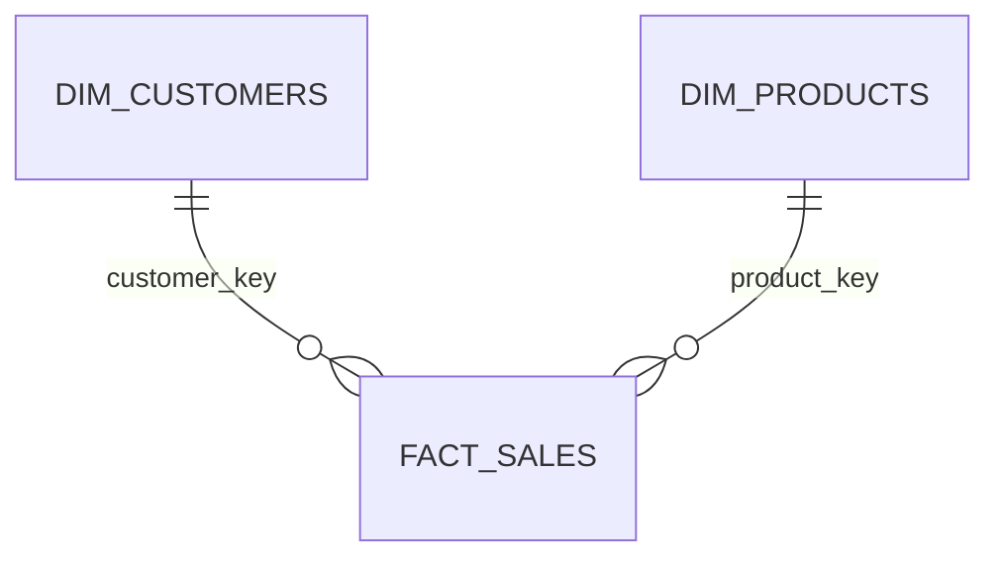

# SQL Server Data Warehouse Project

A portfolio-ready **SQL Server Data Warehouse** built with T-SQL and the **Medallion Architecture (Bronze → Silver → Gold)**.

The project integrates CRM and ERP source extracts, applies data-quality and standardization rules, builds an analytics-ready star schema, and provides reusable business-analysis queries.

## Project Snapshot

| Area | Result |
| --- | --- |
| Source systems | CRM + ERP |
| Source extracts | 6 CSV files |
| Raw customer rows | 18,494 |
| Cleansed customer dimension | 18,484 unique customers |
| Raw product rows | 397 historical product records |
| Current product dimension | 295 products |
| Sales fact rows | 60,398 |
| Gold orphan customer keys | 0 in the supplied extract |
| Gold orphan product keys | 0 in the supplied extract |

> The row counts above were profiled from the supplied project extracts. Raw CSV files are intentionally not committed; see [`docs/data_profile.md`](docs/data_profile.md).

## Architecture



### Bronze — Raw Ingestion

Source data is loaded into SQL Server with minimal transformation using `BULK INSERT` and a stored procedure.

### Silver — Cleansing & Standardization

The transformation layer handles:

- Customer deduplication with `ROW_NUMBER()`
- Leading/trailing whitespace cleanup
- Gender, marital-status, and country standardization
- Customer integration-key normalization across CRM and ERP
- Date conversion and validation
- Product history derivation with `LEAD()`
- Missing/invalid sales and price correction
- Warehouse load timestamps

### Gold — Analytics Model

The business-ready layer exposes a star schema:

- `gold.dim_customers`
- `gold.dim_products`
- `gold.fact_sales`



For column-level documentation, see [`docs/data_dictionary.md`](docs/data_dictionary.md).

## Data Sources

### CRM

- Customer information
- Product information/history
- Sales transactions

### ERP

- Customer demographics
- Customer locations
- Product categories

The expected local dataset layout is documented in [`datasets/README.md`](datasets/README.md).

## Project Structure

```text
.
├── analytics/
│   ├── 01_kpi_summary.sql
│   ├── 02_sales_analysis.sql
│   ├── 03_customer_analysis.sql
│   └── 04_product_analysis.sql
├── datasets/
│   └── README.md
├── docs/
│   ├── data_dictionary.md
│   ├── data_profile.md
│   ├── etl_pipeline.md
│   └── diagrams/
│       ├── 01_data_flow.drawio
│       ├── 02_data_integration_model.drawio
│       └── 03_data_mart_gold_layer.drawio
├── scripts/
│   ├── setup/
│   │   └── 00_init_database.sql
│   ├── bronze/
│   │   ├── 01_ddl_bronze.sql
│   │   └── 02_load_bronze.sql
│   ├── silver/
│   │   ├── 01_ddl_silver.sql
│   │   └── 02_load_silver.sql
│   └── gold/
│       ├── 01_dim_customers.sql
│       ├── 02_dim_products.sql
│       └── 03_fact_sales.sql
├── tests/
│   └── quality_checks/
│       ├── crm/
│       ├── erp/
│       └── gold/
│           ├── dim_customers_checks.sql
│           ├── dim_products_checks.sql
│           └── fact_sales_checks.sql
├── .editorconfig
├── .gitignore
├── LICENSE
└── README.md
```

## Technologies

- Microsoft SQL Server
- T-SQL
- SQL Server Management Studio (SSMS)
- Draw.io
- Git & GitHub

## How to Run

### 1. Initialize the warehouse

Run:

```text
scripts/setup/00_init_database.sql
```

This creates the `DataWarehouse` database when needed and prepares the `bronze`, `silver`, and `gold` schemas.

### 2. Prepare the source extracts

Place local CSV copies using the structure in [`datasets/README.md`](datasets/README.md), then update the local paths in:

```text
scripts/bronze/02_load_bronze.sql
```

### 3. Build and load Bronze

Run:

1. `scripts/bronze/01_ddl_bronze.sql`
2. `scripts/bronze/02_load_bronze.sql`
3. `EXEC bronze.load_bronze;`

### 4. Build and load Silver

Run:

1. `scripts/silver/01_ddl_silver.sql`
2. `scripts/silver/02_load_silver.sql`
3. `EXEC silver.load_silver;`

### 5. Build Gold

Run in order:

1. `scripts/gold/01_dim_customers.sql`
2. `scripts/gold/02_dim_products.sql`
3. `scripts/gold/03_fact_sales.sql`

### 6. Validate the warehouse

Run the source and Gold-model checks under:

```text
tests/quality_checks/
```

The Gold checks validate surrogate keys, referential integrity, positive business measures, sales arithmetic, and date relationships.

### 7. Explore the data

Run reusable queries under `analytics/` for:

- Executive KPI summary
- Monthly/yearly sales trends
- Customer ranking and distribution
- Product/category performance

## Documentation

- [ETL Pipeline](docs/etl_pipeline.md)
- [Data Dictionary](docs/data_dictionary.md)
- [Source Data Profile](docs/data_profile.md)
- [Dataset Setup](datasets/README.md)
- Draw.io architecture diagrams under `docs/diagrams/`

## Key Engineering Features

- Medallion Architecture
- CRM + ERP integration
- Stored-procedure-based ETL
- `TRY...CATCH` error handling
- Full-refresh Bronze/Silver loading
- Deduplication with window functions
- Historical product handling with `LEAD()`
- Data cleaning and standardization
- Star-schema Gold model
- Surrogate keys in the Gold layer
- Source and dimensional data-quality checks
- Reusable analytical queries
- Reproducible database initialization
- Architecture and data-model documentation

## Repository Notes

- Raw CSV files are excluded from Git until redistribution rights are confirmed.
- `BULK INSERT` uses local filesystem paths and must be configured for each environment.
- The Gold customer surrogate key uses the standardized name `customer_key` consistently across dimension, fact, tests, and analytics.

## Author

**Muhammad Elndaf**  
GitHub: [@contactmuhmdelndaf](https://github.com/contactmuhmdelndaf)
