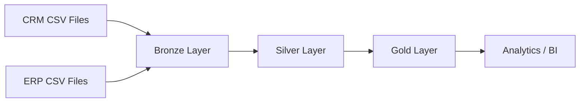

# SQL Server Data Warehouse Project

A portfolio-ready **SQL Server Data Warehouse** built with T-SQL and the **Medallion Architecture (Bronze → Silver → Gold)**.

The project integrates CRM and ERP source data, applies cleansing and standardization rules, and exposes an analytics-ready star schema for reporting and BI use cases.

## Architecture



### Bronze Layer
Raw ingestion layer. Source data is loaded into SQL Server with minimal transformation.

### Silver Layer
Cleansed and standardized layer. It handles tasks such as:

- Deduplication
- Trimming unwanted spaces
- Data standardization
- Date conversion and validation
- Derived attributes
- Data integration between CRM and ERP entities

### Gold Layer
Business-ready data mart implemented as views using a star-schema style model:

- `gold.dim_customers`
- `gold.dim_products`
- `gold.fact_sales`

## Data Sources

### CRM
- Customer information
- Product information
- Sales transactions

### ERP
- Customer demographics
- Customer locations
- Product categories

## Project Structure

```text
.
├── docs/
│   └── diagrams/
│       ├── 01_data_flow.drawio
│       ├── 02_data_integration_model.drawio
│       └── 03_data_mart_gold_layer.drawio
├── scripts/
│   ├── bronze/
│   │   ├── 01_ddl_bronze.sql
│   │   └── 02_load_bronze.sql
│   ├── silver/
│   │   ├── 01_ddl_silver.sql
│   │   └── 02_load_silver.sql
│   └── gold/
│       ├── 01_dim_customers.sql
│       ├── 02_dim_products.sql
│       └── 03_fact_sales.sql
├── tests/
│   └── quality_checks/
│       ├── crm/
│       │   ├── crm_cust_info.sql
│       │   ├── crm_prd_info.sql
│       │   └── crm_sales_details.sql
│       └── erp/
│           ├── erp_cust_az12.sql
│           ├── erp_loc_a101.sql
│           └── erp_px_cat_g1v2.sql
├── LICENSE
└── README.md
```

## Technologies

- Microsoft SQL Server
- T-SQL
- SQL Server Management Studio (SSMS)
- Draw.io
- Git & GitHub

## How to Run

### 1. Create the database and schemas

Create a SQL Server database for the warehouse, then create the required schemas:

```sql
CREATE SCHEMA bronze;
GO
CREATE SCHEMA silver;
GO
CREATE SCHEMA gold;
GO
```

### 2. Build and load the Bronze layer

Run in this order:

1. `scripts/bronze/01_ddl_bronze.sql`
2. `scripts/bronze/02_load_bronze.sql`
3. Execute the Bronze loading procedure.

> **Important:** `02_load_bronze.sql` contains local `BULK INSERT` file paths. Update those paths so they point to the CRM and ERP CSV files on your machine before executing the procedure.

### 3. Build and load the Silver layer

Run:

1. `scripts/silver/01_ddl_silver.sql`
2. `scripts/silver/02_load_silver.sql`
3. Execute the Silver loading procedure.

### 4. Build the Gold layer

Run the Gold scripts in order:

1. `scripts/gold/01_dim_customers.sql`
2. `scripts/gold/02_dim_products.sql`
3. `scripts/gold/03_fact_sales.sql`

### 5. Run data quality checks

Execute the scripts under `tests/quality_checks/` to validate CRM and ERP data quality, consistency, relationships, and business rules.

## Key Features

- Medallion Architecture
- CRM + ERP data integration
- Stored-procedure-based ETL
- `TRY...CATCH` error handling
- Deduplication with `ROW_NUMBER()`
- Historical product handling with `LEAD()`
- Data cleaning and standardization
- Star-schema-style Gold data mart
- Dedicated data quality checks
- Architecture and data-model diagrams

## Repository Notes

- The SQL logic is preserved as authored; the repository structure and filenames are organized for maintainability and portfolio presentation.
- Source CSV datasets are not included in this repository.
- Local `BULK INSERT` paths must be configured before loading source files.

## Author

**Muhammad Elndaf**  
GitHub: [@contactmuhmdelndaf](https://github.com/contactmuhmdelndaf)
