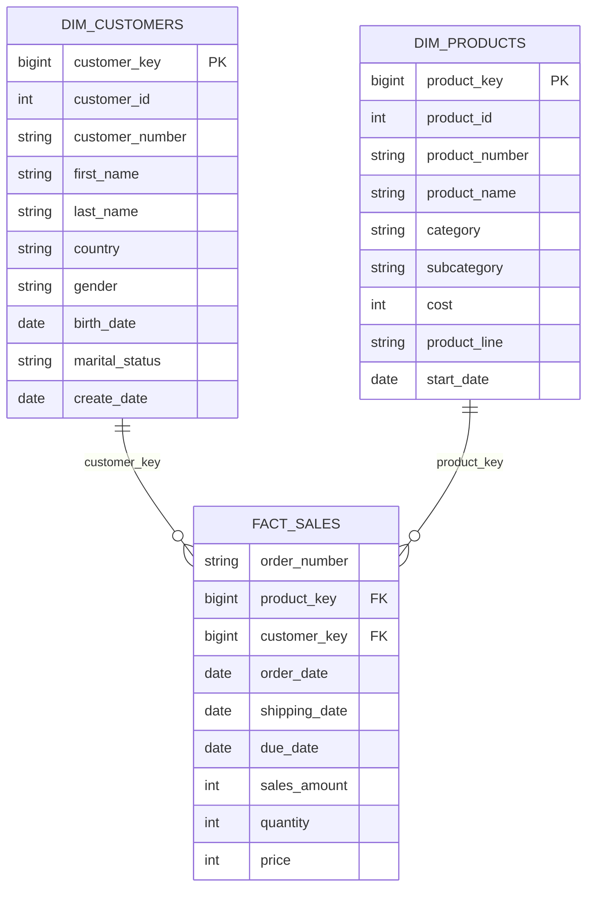

# Data Dictionary

This document describes the main entities exposed by the warehouse, from raw ingestion through the analytics-ready Gold layer.

## Bronze Layer

Bronze tables mirror the supplied CRM and ERP extracts with minimal transformation.

### `bronze.crm_cust_info`

| Column | Type | Description |
| --- | --- | --- |
| `cst_id` | INT | CRM customer identifier. |
| `cst_key` | NVARCHAR(50) | Business customer key used to integrate CRM and ERP data. |
| `cst_firstname` | NVARCHAR(50) | Raw customer first name. |
| `cst_lastname` | NVARCHAR(50) | Raw customer last name. |
| `cst_marital_status` | NVARCHAR(50) | Raw marital-status code. |
| `cst_gndr` | NVARCHAR(50) | Raw gender code. |
| `cst_create_date` | DATE | CRM customer creation date. |

### `bronze.crm_prd_info`

| Column | Type | Description |
| --- | --- | --- |
| `prd_id` | INT | CRM product identifier. |
| `prd_key` | NVARCHAR(50) | Raw product business key containing category and product components. |
| `prd_nm` | NVARCHAR(50) | Product name. |
| `prd_cost` | INT | Product cost from the CRM extract. |
| `prd_line` | NVARCHAR(50) | Raw product-line code. |
| `prd_start_dt` | DATETIME | Product record effective start date. |
| `prd_end_dt` | DATETIME | Product record effective end date from source. |

### `bronze.crm_sales_details`

| Column | Type | Description |
| --- | --- | --- |
| `sls_ord_num` | NVARCHAR(50) | Sales order number. |
| `sls_prd_key` | NVARCHAR(50) | Product business key. |
| `sls_cust_id` | INT | Customer identifier. |
| `sls_order_dt` | INT | Raw order date in `YYYYMMDD` form. |
| `sls_ship_dt` | INT | Raw shipping date in `YYYYMMDD` form. |
| `sls_due_dt` | INT | Raw due date in `YYYYMMDD` form. |
| `sls_sales` | INT | Raw sales amount. |
| `sls_quantity` | INT | Quantity sold. |
| `sls_price` | INT | Raw unit price. |

### ERP Bronze Tables

| Table | Key columns | Purpose |
| --- | --- | --- |
| `bronze.erp_cust_az12` | `cid`, `bdate`, `gen` | Customer birth date and gender enrichment. |
| `bronze.erp_loc_a101` | `cid`, `cntry` | Customer country enrichment. |
| `bronze.erp_px_cat_g1v2` | `id`, `cat`, `subcat`, `maintenance` | Product category and maintenance lookup. |

## Silver Layer

Silver tables preserve the business entities while applying cleansing, standardization, integration-key normalization, and derived values. Each table includes `dwh_create_date` to record warehouse ingestion time.

### Main Silver Transformations

| Entity | Transformation examples |
| --- | --- |
| Customers | Removes duplicate customer IDs, trims names, expands marital-status and gender codes, and ignores rows with null customer IDs. |
| Products | Extracts category ID and product number from the source key, replaces missing cost with `0`, standardizes product line, and derives historical end dates with `LEAD()`. |
| Sales | Converts integer dates to SQL dates and repairs inconsistent/missing sales amount or unit price values from quantity/price relationships. |
| ERP customer | Normalizes prefixed customer IDs, rejects future birth dates, and standardizes gender. |
| ERP location | Removes dashes from customer IDs and standardizes selected country codes/names. |
| ERP category | Loads category/subcategory/maintenance reference data into the standardized layer. |

## Gold Layer

The Gold layer exposes an analytics-ready star schema.

### `gold.dim_customers`

**Grain:** one row per active customer in the CRM customer dimension.

| Column | Description |
| --- | --- |
| `customer_key` | Surrogate customer key generated in the Gold layer. |
| `customer_id` | CRM customer identifier. |
| `customer_number` | CRM/ERP integration business key. |
| `first_name` | Cleansed first name. |
| `last_name` | Cleansed last name. |
| `country` | Customer country from ERP location data. |
| `gender` | Customer gender, prioritizing CRM when available and falling back to ERP. |
| `birth_date` | Customer birth date from ERP. |
| `marital_status` | Standardized marital status. |
| `create_date` | CRM customer creation date. |

### `gold.dim_products`

**Grain:** one row per current product version (`prd_end_dt IS NULL`).

| Column | Description |
| --- | --- |
| `product_key` | Surrogate product key generated in the Gold layer. |
| `product_id` | CRM product identifier. |
| `product_number` | Normalized product business key. |
| `product_name` | Product name. |
| `category_id` | Normalized category key. |
| `category` | ERP product category. |
| `subcategory` | ERP product subcategory. |
| `maintenance` | ERP maintenance indicator. |
| `cost` | Cleansed product cost. |
| `product_line` | Standardized product line. |
| `start_date` | Effective start date of the current product record. |

### `gold.fact_sales`

**Grain:** one row per source sales-detail row.

| Column | Description |
| --- | --- |
| `order_number` | Sales order number. |
| `product_key` | Foreign key to `gold.dim_products`. |
| `customer_key` | Foreign key to `gold.dim_customers`. |
| `order_date` | Cleansed order date. |
| `shipping_date` | Cleansed shipping date. |
| `due_date` | Cleansed due date. |
| `sales_amount` | Cleansed sales value. |
| `quantity` | Quantity sold. |
| `price` | Cleansed unit price. |

## Star Schema Relationships

