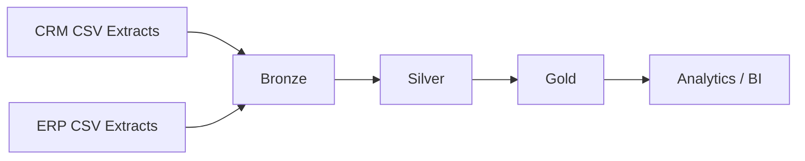

# ETL Pipeline

## Overview

The project follows a three-layer Medallion Architecture:

## 1. Bronze: Raw Ingestion

The Bronze layer mirrors the source extracts in SQL Server and is loaded through `bronze.load_bronze` using `BULK INSERT`.

Responsibilities:

- Preserve source structure.
- Truncate/reload source tables as a full refresh.
- Capture load duration and errors through T-SQL logging messages.
- Keep transformation logic out of the ingestion layer.

## 2. Silver: Cleansing and Standardization

The Silver layer applies data-quality and integration rules in `silver.load_silver`.

### Customer rules

- Ignore rows without a customer ID.
- Keep the latest customer record per `cst_id` with `ROW_NUMBER()`.
- Trim first/last names.
- Standardize marital status to `Single`, `Married`, or `N/A`.
- Standardize CRM gender values.

### Product rules

- Split the composite CRM product key into category and product identifiers.
- Replace missing cost with `0`.
- Standardize product-line codes.
- Build effective end dates using `LEAD()` to support product history.

### Sales rules

- Convert integer dates from `YYYYMMDD` format to SQL `DATE`.
- Replace invalid/missing sales amount using `quantity × |price|`.
- Replace invalid/missing price using `sales / quantity` when possible.

### ERP enrichment rules

- Normalize ERP customer IDs before joining them to CRM customer keys.
- Reject future birth dates.
- Standardize gender and country values.
- Load product category/subcategory enrichment data.

## 3. Gold: Business Model

The Gold layer exposes views for analytics:

- `gold.dim_customers`
- `gold.dim_products`
- `gold.fact_sales`

The model is a star schema with customer and product surrogate keys connected to the sales fact.

## 4. Data Quality

Quality checks exist at two levels:

- Source/Silver-oriented checks under `tests/quality_checks/crm` and `tests/quality_checks/erp`.
- Gold-model checks under `tests/quality_checks/gold` for surrogate-key uniqueness, referential integrity, positive measures, and date/business-rule validation.

## 5. Analytics

Reusable business queries are stored under `analytics/` for:

- KPI summary
- Sales trends
- Customer analysis
- Product/category performance
